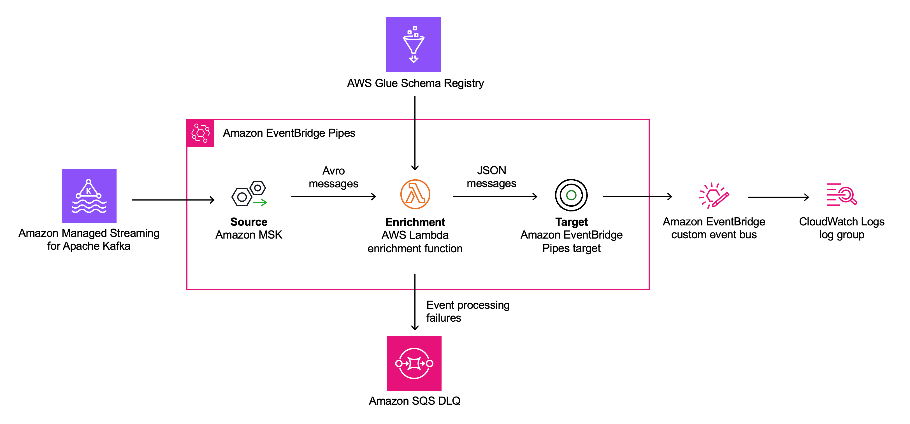

# Event schema validation for Apache Kafka with EventBridge Pipes and Glue Schema Registry

This sample uses AWS Glue Schema Registry to deserialize Avro messages into JSON messages using [Amazon Eventbridge Pipes](https://aws.amazon.com/eventbridge/pipes/) and an enrichment [AWS Lambda](https://aws.amazon.com/lambda/) function.

See the associated blog post on the AWS Compute Blog: https://aws.amazon.com/blogs/compute/converting-apache-kafka-events-from-avro-to-json-using-eventbridge-pipes/

> This architecture will create resources that will incur costs. Please refer to the [AWS Pricing](https://aws.amazon.com/pricing/) page for details and ensure you understand the costs before deploying this stack. This application was written for demonstration and education purposes and not for production use. Take a look at the [Security](#security) section of this readme and consider consulting your security team before deploying this stack. No warranty is implied in this example.

## Requirements

- [Create an AWS account](https://portal.aws.amazon.com/gp/aws/developer/registration/index.html) if you do not already have one and log in. The IAM user that you use must have sufficient permissions to make necessary AWS service calls and manage AWS resources.
- [AWS CLI](https://docs.aws.amazon.com/cli/latest/userguide/install-cliv2.html) installed and configured
- [AWS Cloud Development Kit (AWS CDK)](https://aws.amazon.com/cdk/) installed
- [Git](https://git-scm.com/book/en/v2/Getting-Started-Installing-Git) installed
- [Docker](https://docs.docker.com/engine/install/) installed
- [Java 17](https://openjdk.org/projects/jdk/17/) installed
- [Maven](https://maven.apache.org/) installed
- [Amazon MSK Serverless](https://docs.aws.amazon.com/msk/latest/developerguide/serverless.html) cluster running and a topic to produce test messages

## Deployment Instructions

### Deploy with CDK

1. Create a new directory, navigate to that directory in a terminal and clone the GitHub repository:

   ```bash
   git clone https://github.com/aws-samples/eventbridge-pipes-schema-validation-glue.git
   ```

1. Change directory to the sample directory:

   ```bash
   cd eventbridge-pipes-schema-validation-glue
   ```

1. Create a `virtualenv`:

   ```bash
   python3 -m venv .venv
   ```

1. Activate the `virtualenv`:

   ```bash
   source .venv/bin/activate
   ```

1. Once the `virtualenv` is activated, install the required dependencies:

   ```bash
   pip install -r requirements.txt
   ```

1. You can now synthesize the CloudFormation template for this code:

   ```bash
   cdk synth
   ```

1. Deploy the CDK stack and provide the necessary parameters:

   - `clusterarn`: ARN of your MSK serverless cluster
   - `topicname`: name of the Kafka topic that EventBridge Pipes should poll events from

```bash
   cdk deploy --parameters clusterarn=<Your ARN goes here> --parameters topicname=<Your topic name goes here>
```



This sample sets up an EventBridge pipe with the following key elements:

1. The **source** of the pipe is a topic provided from a MSK serverless Kafka cluster. EventBridge Pipes reads events from the Kafka topic in batches and provides these to the enrichment Lambda function as an event payload.

1. The **enrichment** step of the pipe consists of a Lambda function that validates the incoming events against Glue Schema Registry, deserializes them from Avro, and transforms them to JSON.

1. The **target** of this sample is an EventBridge custom event bus which is invoked by EventBridge Pipes with the events returned by the enrichment Lambda function. EventBridge Pipes supports a variety of other targets, including Lambda, AWS Step Functions, Amazon API Gateway, API destinations, and more.

The Java enrichment function uses the [`AWS Glue Schema Registry Library`](https://github.com/awslabs/aws-glue-schema-registry) for schema validation and Avro deserialization.

The function performs the following tasks:

1. In the events polled by the EventBridge pipe from the Kafka topic, the `value` of the message is `base64` encoded. Therefore, for each message contained in the batch passed to the function, the `key` and the `value` are decoded.

1. The message `value` is deserialized using the `Glue Schema Registry Deserialization Facade` [`AvroDeserializer`](https://github.com/awslabs/aws-glue-schema-registry/blob/master/serializer-deserializer/src/main/java/com/amazonaws/services/schemaregistry/deserializers/GlueSchemaRegistryDeserializerImpl.java).

1. The function returns a list of deserialized events to the EventBridge pipe, which will then invoke the target for each of them.

1. Messages for which processing failed are sent to an Amazon SQS dead letter queue.

## Testing

1. [Create an MSK serverless cluster](https://docs.aws.amazon.com/msk/latest/developerguide/create-serverless-cluster.html).

1. Set up a Kafka producer that serializes messages using the `Customer` schema using AWS Glue Schema registry. This schema has already been created for you.

   You can use a simple Java or Flink application to send test message. You can find the schema here: `shared/customer_schema.avsc`. Use the code sample below to set up a Flink application for producing test messages.

   ```java
   public class DataStreamJob {

   	private static final Logger LOG = LoggerFactory.getLogger(DataStreamJob.class);

   	public static final String BOOTSTRAP_SERVERS = "BOOTSTRAP_SERVERS";
   	public static final String SCHEMA_NAME = "SCHEMA_NAME";
   	public static final String REPOSITORY_NAME = "REPOSITORY_NAME";
   	public static final String TOPIC = "TOPIC";
   	public static final String GROUP_ID = "GROUP_ID";
   	public static final String NUMBER_MESSAGES = "NUMBER_MESSAGES";

   	private static final List<String> MANDATORY_PARAMETERS = Arrays.asList(BOOTSTRAP_SERVERS, SCHEMA_NAME, REPOSITORY_NAME, TOPIC, GROUP_ID, NUMBER_MESSAGES);


   	public static void main(String[] args) throws Exception {

   		final StreamExecutionEnvironment env = StreamExecutionEnvironment.getExecutionEnvironment();

   		Properties flinkProperties = KinesisAnalyticsRuntime.getApplicationProperties().get("FlinkApplicationProperties");

   		if (flinkProperties == null) {
   			LOG.error("Unable to load FlinkApplicationProperties properties from the Kinesis Analytics Runtime. Exiting.");

   			return;
   		}

   		if (! flinkProperties.keySet().containsAll(MANDATORY_PARAMETERS)) {
   			LOG.error("Missing mandatory parameters. Expected '{}' but found '{}'. Exiting.",
   					String.join(", ", MANDATORY_PARAMETERS),
   					flinkProperties.keySet());
   			return;
   		}

   		Properties kafkaConfig = new Properties();
   		kafkaConfig.setProperty(ConsumerConfig.BOOTSTRAP_SERVERS_CONFIG, flinkProperties.getProperty(BOOTSTRAP_SERVERS));
   		kafkaConfig.setProperty(ConsumerConfig.GROUP_ID_CONFIG,flinkProperties.getProperty("GroupId", GROUP_ID));
   		kafkaConfig.setProperty(CommonClientConfigs.SECURITY_PROTOCOL_CONFIG, "SASL_SSL");
   		kafkaConfig.setProperty(SaslConfigs.SASL_MECHANISM, "AWS_MSK_IAM");
   		kafkaConfig.setProperty(SaslConfigs.SASL_JAAS_CONFIG, "software.amazon.msk.auth.iam.IAMLoginModule required;");
   		kafkaConfig.setProperty(SaslConfigs.SASL_CLIENT_CALLBACK_HANDLER_CLASS, "software.amazon.msk.auth.iam.IAMClientCallbackHandler");

   		Map<String, Object> schemaRegistryConfigs = new HashMap<>();
   		schemaRegistryConfigs.put(AWSSchemaRegistryConstants.AWS_REGION, flinkProperties.getProperty("Region", Regions.getCurrentRegion().getName()));
   		schemaRegistryConfigs.put(AWSSchemaRegistryConstants.AVRO_RECORD_TYPE, AvroRecordType.SPECIFIC_RECORD.getName());
   		schemaRegistryConfigs.put(AWSSchemaRegistryConstants.REGISTRY_NAME, flinkProperties.getProperty(REPOSITORY_NAME));
   		schemaRegistryConfigs.put(AWSSchemaRegistryConstants.SCHEMA_NAME, flinkProperties.get(SCHEMA_NAME));

   		String topic = flinkProperties.getProperty(TOPIC);

   		FlinkKafkaProducer<Customer> producer = new FlinkKafkaProducer<>(
   				topic,
   				GlueSchemaRegistryAvroSerializationSchema.forSpecific(Customer.class, topic, schemaRegistryConfigs),
   				kafkaConfig);


   		int numberOfMessages = Integer.parseInt(flinkProperties.getProperty(NUMBER_MESSAGES));

   		DataStream<Customer> stream = env.addSource(new SourceFunction<Customer>() {
   			@Override
   			public void run(SourceContext<Customer> ctx) throws Exception {

   				for (int i=0;i<numberOfMessages;i++){
   					Customer customer = Customer.newBuilder().
   							setCustomerAccountNo((int) (Math.random() * 100))
   							.setCustomerAddress(RandomStringUtils.randomAlphabetic(10))
   							.setEmailAddresses(Arrays.asList(RandomStringUtils.randomAlphabetic(10)))
   							.setFirstName(RandomStringUtils.randomAlphabetic(10))
   							.setLastName(RandomStringUtils.randomAlphabetic(10)).build();

   					LOG.info(customer.toString());
   					Thread.sleep(100);
   					ctx.collect(customer);
   				}
   			}

   			@Override
   			public void cancel() {

   			}
   		});

   		stream.addSink(producer);
   		env.execute();


   		env.execute("Send Messages");
   	}
   }
   ```

1. Deploy this sample using the above deployment instructions. The EventBridge pipe will start polling messages from the Kafka topic.

   Polled message batches are passed to the enrichment Lambda function in the following format. Note that the `key` field is `base64`-encoded and the `value` field is serialized in [Apache Avro](https://avro.apache.org/) as well as `base64`-encoded at this point.

   ```json
   [
     {
       "partition": 0,
       "offset": 20192,
       "timestamp": 1699282778691,
       "timestampType": "CREATE_TIME",
       "value": "AwCTpTSK4StOq6M+06m3n5Q2GBRsZkNtUVZCallOABRibG5GTG9TRHVZAgIUWVhlWmVWZVFjdgAUQ0FITHBlb3h3RgAA",
       "eventSourceArn": "arn:aws:kafka:eu-central-1:12345:cluster/demo-cluster/123455",
       "bootstrapServers": "boot-1234.c3.kafka-serverless.eu-central-1.amazonaws.com:9098",
       "eventSource": "aws:kafka",
       "eventSourceKey": "messages2-0"
     }
   ]
   ```

1. You can confirm the successful deserialization of messages by the enrichment Lambda function in CloudWatch Logs (see [Accessing Amazon CloudWatch logs for AWS Lambda](https://docs.aws.amazon.com/lambda/latest/dg/monitoring-cloudwatchlogs.html) for instructions):

   ```json
   {
     "version": "0",
     "id": "69041bec-5137-603e-fbf5-38c053508c0f",
     "detail-type": "Event from aws:kafka",
     "source": "Pipe pipe-sPZ8f6EbiLuq",
     "account": "00000000000",
     "time": "2023-11-06T15:16:15Z",
     "region": "eu-central-1",
     "resources": [],
     "detail": {
       "customer_account_no": 91,
       "first_name": "XAOZogrzqk",
       "middle_name": null,
       "last_name": "psogpAFqIC",
       "email_addresses": {
         "array": ["ssYLhsTniw"]
       },
       "customer_address": "IRACoMieGq",
       "mode_of_payment": "CARD",
       "customer_rating": null
     }
   }
   ```

## Adapting the Avro schema

This solution registers an Apache Avro schema with Glue Schema Registry during deployment. By default, the following example schema ([`shared/customer_schema.avsc`](shared/customer_schema.avsc)) is used:

```json
{
  "namespace": "example.avro",
  "type": "record",
  "name": "Customer",
  "fields": [
    {
      "name": "customer_account_no",
      "type": "int",
      "doc": "customer account number"
    },
    { "name": "first_name", "type": "string" },
    { "name": "middle_name", "type": ["null", "string"], "default": null },
    { "name": "last_name", "type": "string" },
    {
      "name": "email_addresses",
      "type": ["null", { "type": "array", "items": "string" }]
    },
    { "name": "customer_address", "type": "string", "doc": "customer address" },
    {
      "name": "mode_of_payment",
      "type": {
        "type": "enum",
        "name": "ModeOfPayment",
        "symbols": ["CARD", "CASH"]
      },
      "default": "CARD"
    },
    { "name": "customer_rating", "type": ["null", "int"], "default": null }
  ]
}
```

To make this solution work with your own schema:

1. Replace [`shared/customer_schema.avsc`](shared/customer_schema.avsc) with your own Avro schema file and update the CDK template ([`infrastructure/kafka_glue_validate.py`](infrastructure/kafka_glue_validate.py)) to reflect this change:

   ```python
   schema_file = open("shared/customer_schema.avsc", "r") # Update file name
   ```

1. Replace [`src/java/schemavalidator/src/test/resources`](src/java/schemavalidator/src/test/resources/customer_schema.avsc) with the new schema file.

1. Update the test case [`src/java/schemavalidator/src/test/java/software/amazon/samples/eventbridge`](src/java/schemavalidator/src/test/java/software/amazon/samples/eventbridge/TestDeserializer.java) to use your schema.

## Cleanup

Delete the CDK stack:

```bash
cdk destroy
```

## Security

This application was written for demonstration and education purposes and not for production use. Use the [Security Pillar of the AWS Well-Architected Framework](https://docs.aws.amazon.com/wellarchitected/latest/security-pillar/welcome.html) to ready it for a production depoloyment. Consider the following points:

- The application uses encryption in transit and at rest with AWS-managed keys where applicable. Optionally, use [AWS KMS](https://aws.amazon.com/kms/) with [SQS](https://docs.aws.amazon.com/AWSSimpleQueueService/latest/SQSDeveloperGuide/sqs-server-side-encryption.html) for more control over encryption keys.

- This application logs data inputs and ouputs to CloudWatch Logs. Per the default `info` log level, this does not include message content. If you adjust the log level to `debug`, message content will be logged. Adjust the log level to meet your security requirements.

See [CONTRIBUTING](CONTRIBUTING.md#security-issue-notifications) for more information.

## License

This library is licensed under the MIT-0 License. See the [LICENSE](LICENSE) file.
